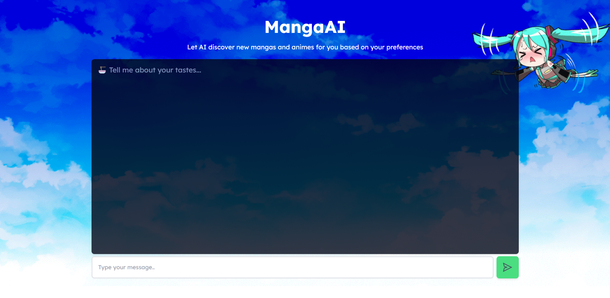
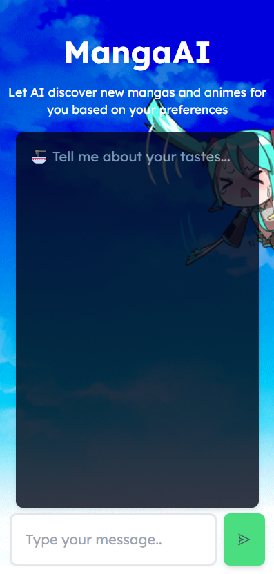

# MangaAI


### About

Welcome to MangaAI, your personalized manga and anime recommendation platform powered by artificial intelligence! 🤖📚

MangaAI is not just another recommendation app; it's your digital manga and anime companion that understands your unique tastes and preferences. By leveraging advanced AI algorithms, MangaAI analyzes your provided preferences and suggests manga and anime titles that are tailor-made just for you.

### Index

- <a href="#layout">Layout</a>
- <a href="#requirements">Requirements</a>
- <a href="#demonstration">Demonstration</a>
- <a href="#technologies-used">Technologies used</a>

### Layout

<p align="center">
  
</p>

<p align="center">
  
</p>

### Requirements

Before getting started, make sure your machine has the following tools: [Git](https://git-scm.com/), [Node.js](https://nodejs.org/en). It is important to have a code editor too, such as [VSCode](https://code.visualstudio.com/).

```bash
# Clone this repository
$ git clone https://github.com/eduvarjaor/mangaAI.git

# Access project folder
$ cd MangaAI

# Install dependencies
$ pnpm i

# Execute the application in development mode
$ pnpm run dev

# The server will open on port:5173 - access http://localhost:5173/
```

### Demonstration

[MangaAI](https://mangaai.netlify.app/)

### Technologies used

The project uses these tools:

1. [React.js](https://legacy.reactjs.org/)
2. [Typescript](https://www.typescriptlang.org/docs/)
3. [TailwindCSS](https://tailwindcss.com/)
4. [Node.js](https://nodejs.org/en)

---

Made with 💙 by eduvarjaor 👋 [See my LinkedIn](https://www.linkedin.com/in/eduvarjaor/?locale=en_US)
